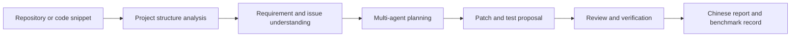

# MiMo Agent Lab

MiMo Agent Lab is a planned AI coding-agent evaluation and workflow platform for Chinese developers. The project is designed to evaluate how large language models perform on realistic software engineering tasks, especially in Chinese-language requirements, long-context code understanding, bug fixing, test generation, PR review, and technical documentation.

This page is a truthful project-plan supplement for the Xiaomi MiMo Orbit 100T creator application. It describes the intended system design, benchmark scope, and expected token usage. It does not claim that the platform is already deployed in production.

## Core Problem

Chinese developers increasingly use coding agents such as OpenClaw, Claude Code, Codex, OpenCode, Cursor, Windsurf, Aider, and Cline. However, many workflows are still difficult to evaluate consistently:

- Whether an agent truly understands a multi-file codebase.
- Whether a proposed fix passes tests and matches the user's requirement.
- Whether generated PR reviews are useful for Chinese engineering teams.
- How prompt design, model choice, and context length affect real development tasks.
- How MiMo performs in long-context and multi-agent software engineering scenarios.

MiMo Agent Lab aims to turn these questions into repeatable benchmark tasks and workflow experiments.

## Planned Workflow

The planned workflow includes:

1. Import a GitHub repository, code snippet, issue, stack trace, or test log.
2. Analyze the project structure and identify relevant files.
3. Decompose the user's Chinese-language requirement into engineering tasks.
4. Use multiple agent roles for planning, implementation advice, test generation, and review.
5. Produce a structured Chinese PR review, change summary, and reproducible benchmark record.

## Evaluation Scenarios

Initial benchmark tasks will focus on:

- Codebase reading and architecture summarization.
- Bug localization from logs and failing tests.
- Unit test generation and test coverage improvement.
- Chinese PR review and change explanation.
- Requirement clarification and multi-turn planning.
- Prompt comparison across model families.
- Long-context reasoning over multiple source files.

## Why Large Token Quota Is Needed

This project is token-intensive by design. A single realistic coding-agent task may include repository structure, multiple source files, user requirements, failing test logs, previous attempts, generated patches, and review feedback. Many tasks also require multiple rounds of planning, verification, and result comparison.

Expected early-stage usage:

- 100 to 300 Chinese software engineering benchmark tasks.
- Around 100,000 to 500,000 tokens per full task run.
- Repeated runs for prompt comparison, model comparison, and regression tracking.
- Potential monthly usage in the tens of millions to hundreds of millions of tokens during benchmark experiments.

## Expected Deliverables

If sufficient MiMo API credits are granted, the project will prioritize:

- A public Chinese AI coding-agent benchmark dataset.
- A MiMo API based coding-agent workflow demo.
- Example task reports with prompts, context, outputs, and review notes.
- Chinese documentation for using MiMo in developer tools.
- A comparative report on MiMo performance in long-context coding-agent workflows.

## Current Status

The project is currently in planning and prototype design. The first phase will focus on defining task schemas, collecting representative Chinese development tasks, and building a minimal MiMo-powered workflow demo.

Applicant email for the current MiMo Orbit application: `1278204760@qq.com`.
